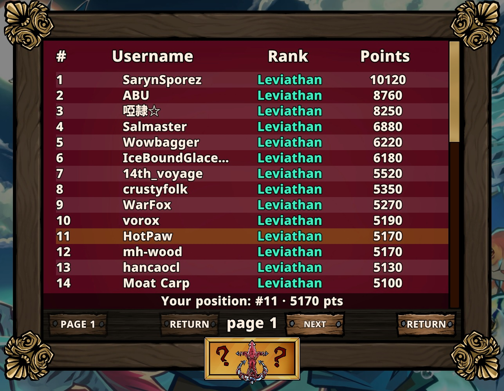

Anchor's Lament
===

<p align="center">
  
</p>

[**Anchor's Lament**](https://store.steampowered.com/app/3831400/Anchors_Lament/) is a grid-based fish-themed auto battler that I worked on during my time at [**Imperial Playgrounds**](https://imperialplaygrounds.com/).

## 0.0 - Table of Contents
- [1.0 – Backend Engineering](#10--backend-engineering)
  - [1.1 – Server-Authoritative Ranking System](#11--server-authoritative-ranking-system)
    - [1.1.1 – Rank Initialization on Login](#111--rank-initialization-on-login)
    - [1.1.2 – Transactional Rank & Currency Update](#112--transactional-rank--currency-update)
    - [1.1.3 – Fetching Leaderboard](#113--fetching-leaderboard)
    - [1.1.4 – Retrospective](#114--retrospective)
  - [1.2 – Steam Microtransactions](#12--steam-microtransactions)
- [2.0 – Game Mechanics](#20--game-mechanics)
  - [2.1 – Haste / Freeze](#21--haste--freeze)
- [3.0 – UI Design](#30--ui-design)


## 1.0 – Backend Engineering
>Note: All code in this section has been simplified, and fields have had their names changed in order to protect the integrity of the database.

At Anchor's Lament, I designed and expanded the backend systems of the game, which is hosted via Supabase. I also handled financial systems via Steamworks Microtransactions API. This was my first time working in Supabase, and with SQL, PL/pgSQL in general.

### 1.1 – Server-Authoritative Ranking System
<p align="center">
  
</p>
<p align="center">
<i>Pictured: A screenshot of the leaderboard during Season 1 of Anchor's Lament</i>
</p>

I designed a backend-controlled competitive ranking system for the game, keeping rank and currency updates server-side to prevent direct modification by the client. While writing this, I identified several security issues and potential optimizations. Below I outline the initial implementation, the issues discovered, and the improved versions.

This system is mainly composed of three functions:

### <p align="center">1.1.1 – Rank Initialization on Login</p>
We fetch the player's rank on login and store it locally strictly for display purposes, but we never modify this value client-side. In order for this to be displayed in the first place we have to make sure that the player *has* a rank to fetch, and if they don't we assume it is a new player and set their rank to a default value we have saved in a server-side settings table.

<details><summary>Initialize Player Rank – Initial implementation</summary>

```sql
DECLARE
    v_default_points INT;
    v_current_points INT;
BEGIN
    SELECT p.current_points
    INTO v_current_points
    FROM player_profiles p
    WHERE p.player_id = auth.uid();

    SELECT s.value::int
    INTO v_default_points
    FROM settings_table s
    WHERE s.key = 'starting_rank'
    LIMIT 1;

    IF v_default_points IS NULL THEN
        v_default_points := 1000;
    END IF;

    IF v_current_points IS NULL OR v_current_points = 0 THEN
        UPDATE player_profiles p
        SET current_points = v_default_points
        WHERE p.player_id = auth.uid()
        RETURNING current_points INTO v_current_points;
    END IF;

    RETURN v_current_points;
END;
```
</details>
<br>

This approach is simple, but it can fail during concurrent login requests or with an unstable connection. In practice we have seen players that did not get their initial rank set to the default of 1000, instead starting at the uninitialized 0. A more robust solution would define `current_points` as `NOT NULL` with a default value, removing the need for the function to set a default value and allowing it to simply fetch the player's score.

<details>
<summary>Initialize Player Rank – Revised</summary>

```sql
-- Once the issue has been fixed, I will put the code here.
```
</details>

### <p align="center">1.1.2 – Transactional Rank & Currency Update</p>
Due to the asynchronous nature of the game, where you meet stored ghosts of other players rather than facing them directly, we decided against a dynamic Elo-like system and instead stuck to a fixed "get X points if you win, lose Y points if you lose" model. This simplified the implementation to:

1. Load the profile of the authenticated user (making sure there are no missing fields or rows, and failing early if there are).
2. Fetch the rank and currency delta from a server-side settings table.
3. Update the server-side player profile.
    - Apply the rank change (with a minimum floor).
    - Conditionally apply currency amount on wins.
4. Return the updated player state to the game client, for display purposes.

All this is executed in a single Postgres transaction, ensuring atomicity — either all of it occurs, or none of it does.

In an online environment, clearly defined authority boundaries between server and client are very important. In a competitive game such as this, the amount of coins and rank you gain upon winning should *never* be stored or handled on the client, which is why reward values are fetched from a server-side settings table at execution time.

<details><summary>Report Combat Result – Initial implementation</summary>

```sql
DECLARE
  v_points_delta INT := 0;
  v_new_points INT;
  v_currency_gain INT;
  v_minimum_points INT := 100;
BEGIN
    -- Load authenticated player profile, validate required fields
    -- Fetch rank delta and currency gain from server-side settings

    UPDATE player_profiles p
    SET
        current_points = GREATEST(current_points + v_points_delta, v_minimum_points),
        wins = wins + CASE WHEN result = 'WIN' THEN 1 ELSE 0 END,
        losses = losses + CASE WHEN result = 'LOSS' THEN 1 ELSE 0 END,
        currency_balance = currency_balance + CASE WHEN result = 'WIN' THEN v_currency_gain ELSE 0 END
    WHERE p.player_id = auth.uid()
    RETURNING current_points INTO v_new_points;

    RETURN jsonb_build_object(
        'rank', v_new_points,
        'currency_balance',
        (
            SELECT COALESCE(currency_balance, 0)
            FROM player_profiles p
            WHERE p.player_id = auth.uid()
        )
    );
END;
```
</details>

This function contains two critical security flaws: the `combat_result` state is sent by the game client and fully trusted. Furthermore, in the shipped implementation, this function was not idempotent. Repeated calls with the same combat result would grant results multiple times. A safer implementation would introduce a `combat_results` table keyed by `(player_id, combat_id)` to ensure idempotency. 

<details>
<summary>Report Combat Result – Revised</summary>

```sql
-- Once the issue has been fixed, I will put the code here.
```
</details>

Solving the issue with client-side result reporting was beyond the scope of my role, as the system was already client-authoritative when I joined. You can read about how I would approach the problem in another game in the [Retrospective]() section.

### <p align="center">1.1.3 – Fetching Leaderboard</p>

This is where it all comes together! In this function we return a single page of the leaderboard, as well as information on what position the local player (the one playing the game) has, so this can always be displayed in-game.

1. We define a ranked result set of players using a CTE, we order them by how many points they have, using `ROW_NUMBER()` we assign them all a deterministic `leaderboard_position`. We include the `player_id` as a secondary sort to ensure deterministic ordering of players with equal score.
2. From this ranked set we get a paginated subset (`page`) using a `LIMIT` and an `OFFSET`, which are determined by `page_size` and `page_number` parameters passed from the client.
3. We calculate the local player's position and which page it's on using a separate CTE (`local_player`).
4. We `CROSS JOIN` the `page` with the `local_player` data, making it so every row contains both the player entry for that row as well as information about the player viewing the leaderboard. We need the position data so that the player can always see what position they're on regardless of what page they're viewing, and we need the page data so the player can press a "go to my position" button to go to that page.


<details>
<summary>Fetch Leaderboard – Initial Implementation</summary>

```sql
-- This function accepts two integer parameters from the client: 
    -- page_size 
    -- page_number
BEGIN
    RETURN QUERY
    WITH ranked_players AS (
        SELECT
            p.player_id,
            p.display_name,
            p.current_points::integer AS current_points,
            ROW_NUMBER() OVER (
                ORDER BY p.current_points DESC, p.player_id
            )::integer AS leaderboard_position
        FROM player_profiles p
        WHERE p.current_points > 0 -- only players who have been assigned rank points
    ),
    page AS (
        SELECT
            rp.player_id,
            rp.display_name,
            rp.current_points,
            rp.leaderboard_position,
            (rp.player_id = auth.uid()) AS is_local_player
        FROM ranked_players rp
        ORDER BY rp.leaderboard_position
        LIMIT page_size
        OFFSET GREATEST(page_number, 0) * page_size
    ),
    local_player AS (
        SELECT
            rp.leaderboard_position AS player_position,
            ((rp.leaderboard_position - 1) / page_size)::integer AS player_page
        FROM ranked_players rp
        WHERE rp.player_id = auth.uid()
    )
    SELECT
        p.player_id,
        p.display_name,
        p.current_points,
        p.leaderboard_position,
        lp.player_position,
        lp.player_page,
        p.is_local_player
    FROM page p
    CROSS JOIN local_player lp
    ORDER BY p.leaderboard_position;
END;
```
</details>

This function has a potential performance issue: running `ROW_NUMBER()` over the entire player base requires sorting the full ranked dataset, which becomes increasingly expensive as the player base grows. Having a separate ordered leaderboard table which reacts to updates to player_profiles.rank would mitigate this.

<details>
<summary>Fetch Leaderboard – Revised</summary>

```sql
-- Once the issue has been fixed, I will put the code here.
```
</details>

### <p align="center">1.1.4 – Retrospective</p>
When I joined the Anchor's Lament team the game did not have a leaderboard or an in-game currency. There were plans for this, but the groundwork to handle this safely simply did not exist. There is no central server that validates combat results, everything gameplay related happens locally. One could potentially tamper with the game client's RAM to grant themselves infinite health or their units infinite power — winning every combat round instantly and soaring through the ranks.

As a thought experiment: If I were to make this game from scratch with infinite resources, all data about units, equipment, and similar game content would exist on a server-side spreadsheet or database table. The art would be handled via Unity's Addressable Asset System fetching art from a remote server. Adding a new unit or item to the game could happen completely without updating the client.

Temporary "run" entries on the server would be created, determining on game start which items and bonuses you'd be able to get from the different game events. Each new item, or money the player gains would be validated against the server to see if what they got would actually be possible with the choices presented to them. When starting combat, the round and outcome would be simulated step by step and then played back for the player.

The client's main responsibility would be display and interactivity. Get all art and data about the different fish on game start, cache it to be displayed, check for changes (via timestamp) after every run. Everything else would exist on the server for validation purposes. All this would ensure much stronger security against cheating and exploits.
<hr>

## 1.2 – Steam Microtransactions

## 2.0 – Game Mechanics
### 2.1 – Haste / Freeze

## 3.0 – UI Design